# P&C Insurance Medallion Architecture

**Version:** 4.1  
**Last Updated:** 2026-09-29  
**Repository:** `vedavyasgoparaju/pc-insurance-medallion`  
**Workspace:** `https://dbc-ec4d2e3d-58c3.cloud.databricks.com`

---

## Table of Contents

1. [Overview](#overview)
2. [Architecture Diagram](#architecture-diagram)
3. [Architecture Layers](#architecture-layers)
3. [Multi-Agent System](#multi-agent-system)
3. [Agent Roles & Responsibilities](#agent-roles--responsibilities)
4. [Metadata-Driven Framework](#metadata-driven-framework)
5. [Data Flow](#data-flow)
6. [Unity Catalog Structure](#unity-catalog-structure)
7. [Pipeline Orchestration](#pipeline-orchestration)
8. [Deployment Architecture](#deployment-architecture)
9. [[Operations & Monitoring](#operations--monitoring)
10. [Performance Optimization](#performance-optimization)
11. [Future Enhancements](#future-enhancements)

---

## Overview

The P&C Insurance Medallion Architecture is a comprehensive data platform built on Databricks that implements:

- **Medallion Architecture**: Bronze → Silver → Gold layers
- **Multi-Agent System**: 8 specialized AI tools (7 agents + 1 MCP server) for different domains
- **Self-Healing Pipelines**: Autonomous swarm with circuit breaker, knowledge-based fixes, automated rollback, and health monitoring
- **Metadata-Driven Pipelines**: Configuration-based Silver and Gold transformations
- **Unity Catalog Governance**: Centralized data governance and security
- **Declarative Automation**: DAB-based deployment and CI/CD

### Key Features

✅ **Automated Data Pipeline**: End-to-end Bronze → Silver → Gold processing  
✅ **AI-Powered Agents**: Domain experts, analysts, architects, and engineers  
✅ **Metadata-Driven**: No hardcoded transformations, all config-based  
✅ **SCD Type 2**: Historical tracking for dimensions  
✅ **Data Quality**: Built-in validation and reconciliation  
✅ **Self-Healing**: Circuit breaker, fix knowledge base, automated rollback, dependency verification  
✅ **Health Monitoring**: Composite health score, 6-hour monitoring cycle, anomaly alerting  
✅ **PII Masking**: Automated sensitive data protection  
✅ **Git Integration**: Version control and CI/CD ready

---

## Architecture Diagram

> **Interactive version**: Open [`docs/architecture_diagram.html`](architecture_diagram.html) in a browser for hover-over descriptions of each component.

```mermaid
flowchart TB
    subgraph Sources["📤 Source Systems"]
        SRC["Policy Admin · Claims Mgmt<br/>Billing · Customer Master · Agent Data"]
    end

    subgraph UC["🗄️ Unity Catalog: pc_insurance"]
        subgraph Bronze["🥉 Bronze Layer — Raw Ingestion"]
            BZ["5 raw tables<br/>policies_raw · claims_raw<br/>premiums_raw · customers_raw · agents_raw"]
        end
        subgraph Silver["🥈 Silver Layer — Cleansed & Conformed"]
            SV["7 tables (4 dims + 2 facts + date_dim)<br/>SCD2 · PII masking · dedup"]
        end
        subgraph Gold["🥇 Gold Layer — Business KPIs"]
            GD["6 KPI tables<br/>loss_ratio · frequency_severity<br/>retention · growth · exposure · uw_dashboard"]
        end
        subgraph Ref["📋 Reference Schema — Metadata-Driven Config"]
            RF["silver_transformation_config<br/>gold_metric_config<br/>audit · reconciliation tables"]
        end
        subgraph DQ["✅ DQ Schema — Data Quality"]
            DQF["8 DQ SQL functions + dq_validation_results<br/>check_policy_exists · check_claim_status<br/>check_premium_positive · check_loss_ratio<br/>check_not_null · check_date_order · calculate_dq_score<br/>pipeline_health_score"]
        end
        subgraph Meta["🔧 Metadata Schema — Swarm Infrastructure"]
            MT["mapping_documents · threshold_controls<br/>swarm_fix_history · health_monitor_log<br/>technical_docs volume<br/>7 toolkit SQL functions"]
        end
    end

    SRC -->|"Bronze_Pipeline.py"| Bronze
    Bronze -->|"Silver_Pipeline_Metadata.py"| Silver
    Silver -->|"Gold_Pipeline.py"| Gold
    Ref -.->|"config"| Silver
    Ref -.->|"config"| Gold
    DQ -.->|"validates"| Silver
    DQ -.->|"validates"| Gold

    subgraph Agents["🤖 Multi-Agent System — Supervisor Orchestrator"]
        SUP["Supervisor Agent<br/>mas-3fcb11f6-endpoint"]
        ARCH["Unified Agent<br/>pc_insurance_agent"]
        DOM["Domain Expert Agent<br/>Knowledge Assistant (RAG)"]
        ANA["Analyst Agent<br/>Genie Space"]
        DEV["DevOps Agent<br/>Genie Space"]
        QA["QA Validator<br/>calculate_dq_score"]
        MCP["Workspace-Actions<br/>MCP App (git, files, SQL)"]
    end

    SUP --> ARCH & DE & DOM & ANA & DEV & QA & MCP

    subgraph Swarm["🔄 Autonomous Agent Swarm — LangGraph Self-Healing"]
        SW1["Supervisor<br/>(Llama 3.3 70B)"]
        SW2["Triage<br/>jobs.get_run()"]
        SW3["Business Analyst<br/>mapping_documents"]
        SW4["Data Engineer<br/>toolkit functions"]
        SW5["QA<br/>calculate_dq_score"]
        SW6["Deployment<br/>jobs.repair_run()"]
        SW1 --> SW2 --> SW3 --> SW4 --> SW5 --> SW6
        SW7["RollbackManager<br/>Delta RESTORE"]
        SW8["DependencyChecker<br/>UC lineage check"]
        SW6 --> SW7
        SW6 --> SW8
    end

    Meta -->|"metadata + toolkit"| Swarm
    Swarm -.->|"repair"| Bronze
    Swarm -.->|"repair"| Silver
    Swarm -.->|"repair"| Gold

    subgraph Jobs["⚙️ Job Orchestration"]
        J1["Job 1: Agent Setup (run once)<br/>9 parallel tasks + 1 dependent<br/>~20 min"]
        J2["Job 2: Data Pipeline<br/>Bronze→Silver→Gold→Swarm<br/>load_type: INITIAL | INCREMENTAL"]
        J3["Job 3: Health Monitor (every 6h)<br/>Table freshness · DQ pass rate<br/>Swarm success · health_score"]
    end

    J1 -->|"deploys"| Agents
    J1 -->|"provisions"| Swarm
    J2 -->|"runs"| Bronze
    J2 -->|"runs"| Silver
    J2 -->|"runs"| Gold
    J2 -.->|"on failure"| Swarm

    subgraph Consumption["📊 Consumption Layer"]
        AQ["Analyst Agent Queries ✅"]
        BI["BI Dashboards 🔲 (Planned)"]
        ML["ML Models 🔲 (Planned)"]
    end

    Gold --> AQ
    Gold -.->|"planned"| BI
    Gold -.->|"planned"| ML

```



---

## Architecture Layers

### Bronze Layer (Raw Ingestion)

**Purpose**: Ingest raw data from source systems with minimal transformation

**Tables**:
- `policies_raw` - Policy administration data (~1,000 records)
- `claims_raw` - Claims management data (~300 records)
- `premiums_raw` - Billing and premium transactions (~1,200 records)
- `customers_raw` - Customer master data (~500 records)
- `agents_raw` - Agent and agency data (~50 records)

**Characteristics**:
- Schema enforcement only
- Preserve source data lineage
- Append-only (with ingestion timestamp)
- Partitioned by ingestion date
- Delta Lake format

**Implementation**: `pipelines/Bronze_Pipeline.py`

### Silver Layer (Cleansed & Conformed)

**Purpose**: Cleanse, standardize, and historize data with SCD Type 2

**Dimensions** (SCD2):
- `policy_dim` - Policy dimension with history
- `claim_dim` - Claim dimension with history
- `customer_dim` - Customer dimension with PII masking
- `agent_dim` - Agent dimension with history
- `date_dim` - Date dimension (static)

**Facts**:
- `premium_fact` - Premium transactions
- `claim_fact` - Claim financial details

**Characteristics**:
- **Metadata-Driven**: Transformations driven by `silver_transformation_config`
- **SCD Type 2**: `is_current`, `effective_from`, `effective_to` tracking
- **Data Cleansing**: Standardization, null handling, type conversion
- **PII Masking**: Customer names masked
- **Deduplication**: Latest record based on ingestion timestamp
- **Audit Logging**: Every run logged in `silver_load_audit`
- **Reconciliation**: Source vs target counts in `silver_reconciliation`

**Implementation**: `pipelines/Silver_Pipeline_Metadata.py`

### Gold Layer (Business KPIs)

**Purpose**: Pre-aggregated business metrics for analytics and reporting

**Tables**:
- `loss_ratio_by_lob` - Loss ratio by line of business
- `claim_frequency_severity` - Frequency and severity by state
- `retention_by_agent` - Policy retention by agent
- `premium_growth` - Premium growth trends over time
- `exposure_summary` - Exposure by state and LOB
- `uw_dashboard_summary` - Comprehensive underwriting dashboard

**Characteristics**:
- **Metadata-Driven**: Metrics driven by `gold_metric_config`
- **Pre-Aggregated**: Optimized for BI tools
- **Business Logic**: Loss ratios, frequencies, retention rates
- **Audit Logging**: Every refresh logged in `gold_load_audit`
- **Data Quality Scores**: DQ metrics tracked per refresh

**Implementation**: `pipelines/Gold_Pipeline.py`

---

## Multi-Agent System

The platform uses a **multi-agent architecture** where specialized AI agents handle different aspects of the data platform.

### Agent Architecture

```
                    ┌─────────────────────┐
                    │  Supervisor Agent   │
                    │   (Orchestrator)    │
                    └──────────┬──────────┘
                               │
                ┌──────────────┼──────────────┐
                │              │              │
        ┌───────▼──────┐ ┌────▼─────┐ ┌─────▼──────┐
        │  Architect   │ │   Data   │ │   Domain   │
        │    Agent     │ │ Engineer │ │   Expert   │
        └──────────────┘ └──────────┘ └────────────┘
                │              │              │
        ┌───────▼──────┐ ┌────▼─────┐ ┌─────▼──────┐
        │   Analyst    │ │  DevOps  │ │     QA     │
        │    Agent     │ │   Agent  │ │ Validator  │
        └──────────────┘ └──────────┘ └────────────┘
                │              │              
        ┌───────▼──────────────▼──────┐
        │ Documentation Agent         │
        └────────────────────┬────────┘
                             │
                ┌────────────▼─────────────┐
                │ Workspace-Actions (MCP)  │
                │  (Git, File, SQL Exec)   │
                └──────────────────────────┘
```

### Agent Communication Flow

1. **User Request** → Supervisor Agent
2. **Supervisor** analyzes request and routes to appropriate agent(s)
3. **Specialist Agent(s)** process request and return results
4. **Supervisor** synthesizes responses and returns to user

---

## Agent Roles & Responsibilities

### 1. Supervisor Agent

**Role**: Orchestrates multi-agent workflows and routes requests

**Responsibilities**:
- ✅ Analyze user requests and determine which agents to invoke
- ✅ Route questions to appropriate specialist agents
- ✅ Synthesize responses from multiple agents
- ✅ Manage agent execution order and dependencies
- ✅ Handle errors and fallback logic

**Implementation**: `Supervisor_Agent.py`
**Endpoint**: `mas-3fcb11f6-endpoint` (READY)
**Agent ID**: `3fcb11f6-0410-4be0-9d04-1e1a351ceb59`

### 2. Architect Agent

**Role**: Principal Data Architect & Senior Data Engineer (merged)

**Responsibilities**:
- Design Bronze/Silver/Gold layer schemas
- Define table structures and relationships
- Plan data flow topology
- Design Unity Catalog governance model
- Define partitioning and optimization strategies
- Write Spark/SQL transformation code
- Implement Bronze → Silver → Gold pipelines
- Create metadata-driven frameworks
- Implement SCD Type 2 logic
- Write data quality expectations

**Implementation**: `Unified_Insurance_Agent.py` (serving_endpoint `pc_insurance_agent`, MLflow model `workspace.default.pc_unified_agent` v2, ChatAgent with streaming support)

### 3. Domain Expert Agent

**Role**: Provides P&C insurance domain knowledge and business context

**Responsibilities**:
- Answer questions about P&C insurance concepts
- Explain loss ratios, combined ratios, frequency/severity
- Provide context on policy lifecycle
- Explain claims processing and reserving
- Interpret NAIC requirements

**Implementation**: `Domain_Expert_Agent.py`
**Data Source**: UC Volume `pc_insurance.reference.pc_domain_docs`

### 5. Analyst Agent

**Role**: Answers business questions by querying Gold layer KPIs

**Responsibilities**:
- Query Gold layer tables for business metrics
- Calculate loss ratios, frequencies, retention rates
- Provide trend analysis
- Generate business reports

**Implementation**: `Analyst_Genie_Agent.py` (genie_space)
**Key Metrics**:
- Loss Ratio = Incurred Loss / Earned Premium
- Claim Frequency = Claims / Policies
- Claim Severity = Incurred Loss / Claims
- Retention Rate = Renewed / (Renewed + Cancelled)
- Premium Growth = (Current - Previous) / Previous

### 6. DevOps Agent

**Role**: Provides guidance on Git, CI/CD, and deployment (GUIDANCE ONLY)

**Responsibilities**:
- Advise on Git workflows and branching strategies
- Guide CI/CD pipeline setup
- Explain Databricks Asset Bundles (DAB)
- Provide deployment best practices
- Troubleshoot Git issues

**Implementation**: `DevOps_Agent.py` (genie_space)

### 7. QA Validator Agent

**Role**: Validates data quality and runs validation checks

**Responsibilities**:
- Run data quality checks on tables
- Validate data completeness, validity, consistency
- Check business rule compliance
- Generate DQ reports

**Implementation**: Via `pc_insurance.dq.calculate_dq_score` (uc_function)

### 8. Workspace-Actions (MCP App)

**Role**: EXECUTES workspace changes (git commits, file writes, SQL execution)

**Implementation**: `app/app.py` (MCP app `pc-insurance-workspace-actions`)

### Anti-Routing Rules

1. KPI questions → **Analyst only** (never DevOps or Documentation)
2. Git execution → **Workspace-Actions** (DevOps is guidance only)
3. Architecture design → **Architect** (not Data Engineer)
4. Code implementation → **Data Engineer** (not Architect)
5. Domain definitions → **Domain Expert** (not Analyst)
6. DevOps → **Guidance only** (cannot execute Git operations)

---

## Metadata-Driven Framework

### Silver Layer Metadata

**Configuration Table**: `pc_insurance.reference.silver_transformation_config`

Defines: source/target tables, transformation type (SCD2, FACT, DEDUP), business keys, column mappings, cleansing rules, deduplication strategy, SCD2 enablement, execution order.

**Audit Table**: `pc_insurance.reference.silver_load_audit` — tracks transformation ID, run timestamp, status, source/target row counts, execution time, error messages.

**Reconciliation Table**: `pc_insurance.reference.silver_reconciliation` — validates source vs target counts, count match status, reconciliation notes.

**Example Configuration**:
```sql
INSERT INTO silver_transformation_config VALUES (
  'SILVER_POLICY_DIM', 'Policy Dimension',
  'bronze', 'policies_raw', 'silver', 'policy_dim',
  'SCD2', ARRAY('policy_id'),
  MAP('policy_status', 'UPPER(TRIM(policy_status))'),
  'LATEST', 'ingestion_timestamp', TRUE, 1, TRUE
);
```

### Gold Layer Metadata

**Configuration Table**: `pc_insurance.reference.gold_metric_config`

Defines: metric name/category, target table, source tables, dimension columns, measure columns, calculation logic, aggregation grain, refresh frequency, execution order.

**Example Configuration**:
```sql
INSERT INTO gold_metric_config VALUES (
  'GOLD_LOSS_RATIO_LOB', 'Loss Ratio by Line of Business',
  'LOSS_RATIO', 'gold', 'loss_ratio_by_lob',
  ARRAY('silver.policy_dim', 'silver.claim_fact'),
  ARRAY('line_of_business'),
  ARRAY('total_incurred_loss', 'total_earned_premium', 'loss_ratio'),
  'SUM(incurred_loss) / SUM(earned_premium) AS loss_ratio',
  'LINE_OF_BUSINESS', 'DAILY', 1, TRUE
);
```

**Audit Table**: `pc_insurance.reference.gold_load_audit` — tracks metric ID, refresh timestamp, status, row counts, metric values, DQ scores, execution time.

---

## Autonomous Agent Swarm

The platform includes a **LangGraph-based autonomous agent swarm** that provides self-healing pipeline operations.

### Architecture

The swarm uses a **Plan-Execute-Verify-Deploy** loop with 6 specialized agents and 2 built-in safety components:

1. **Supervisor** — Orchestrates the swarm, assigns tasks (Llama 3.3 70B)
2. **Triage** — Fetches real error logs via `jobs.get_run()` and `jobs.get_run_output()`, queries fix knowledge base for similar past resolutions
3. **Business Analyst** — Updates mapping metadata in `pc_insurance.metadata.mapping_documents`
4. **Data Engineer** — Applies schema/code fixes using the toolkit functions
5. **QA** — Validates fixes using `pc_insurance.dq.calculate_dq_score`
6. **Deployment** — Triggers pipeline repair via `jobs.repair_run()`
7. **RollbackManager** — Automated Delta `RESTORE` if DQ score drops >10% post-fix; records pre-fix timestamp and compares `dq_score_before` / `dq_score_after`
8. **DependencyChecker** — Verifies downstream table freshness via Unity Catalog lineage after upstream fixes

### Metadata Catalog

- **Catalog**: `pc_insurance.metadata`
- **Tables**:
  - `mapping_documents` (7 rows, ACORD-standard mappings)
  - `threshold_controls` (4 rows, KPI thresholds with CAT event overrides)
  - `swarm_fix_history` — tracks every autonomous fix attempt with `circuit_breaker_triggered` column
  - `health_monitor_log` — pipeline health metrics over time (health_score, stale tables, DQ pass rate, swarm success rate)
- **UC Volume**: `pc_insurance.metadata.technical_docs` with subdirs: `post_mortems`, `schema_docs`, `escalations`
- **DQ Table**: `pc_insurance.dq.dq_validation_results` — individual DQ rule validation outcomes (partitioned by `table_name`)
- **Health Function**: `pc_insurance.dq.pipeline_health_score()` — composite health score: DQ (40%) + Freshness (25%) + Reconciliation (20%) + Error Rate (15%)

### Guardrails

- Max 5 ReAct iterations per agent
- $25 token budget per swarm run
- UC Network Rules enforced
- Sandbox isolation (prefix `dev_sandbox_`)
- **Circuit Breaker**: Halts the swarm after 3+ failed fix attempts on the same `error_signature` within a 6-hour window. When triggered, logs `circuit_breaker_triggered = TRUE` in `swarm_fix_history` and escalates instead of retrying
- **Fix Knowledge Base**: Before attempting a new fix, the Triage Agent queries `swarm_fix_history` for similar past successful resolutions using `error_signature` matching, accelerating resolution by reusing proven fix strategies

### Infrastructure Provisioning

All swarm infrastructure — including the 7 toolkit functions, DQ functions, `swarm_fix_history`, `health_monitor_log`, `dq_validation_results`, and `pipeline_health_score()` — is provisioned by Job 1 tasks (`swarm_setup`, `dq_functions_setup`, `toolkit_functions_setup`, `autonomy_infrastructure_setup`). The `autonomy_infrastructure_setup` task creates autonomy UC artifacts idempotently via `CREATE IF NOT EXISTS` and depends on `swarm_setup` and `dq_functions_setup`.

### Trigger Paths

1. **Automatic**: Pipeline task fails → `autonomous_swarm` task triggers (Job 2, `run_if=AT_LEAST_ONE_FAILED`)
2. **Manual**: Standalone swarm job `PC_Insurance_Autonomous_Swarm` (ID: `774564996988013`)
3. **Interactive**: Supervisor Agent chat routes to `workspace-actions` MCP tool

### Implementation

**Notebook**: `swarm/PC_Insurance_Autonomous_Agent_Swarm.py` (24 cells)

---

## Data Flow

### End-to-End Pipeline Flow

```
SOURCE SYSTEMS → BRONZE LAYER (Bronze_Pipeline.py)
  → SILVER LAYER (Silver_Pipeline_Metadata.py)
  → GOLD LAYER (Gold_Pipeline.py)
  → CONSUMPTION LAYER (BI Dashboards, Analyst Agent, ML models)
```

---

## Unity Catalog Structure

### Catalog: `pc_insurance`

```
pc_insurance/
├── bronze/                    # Raw ingested data
├── silver/                    # Cleansed & conformed
├── gold/                      # Business KPIs
├── reference/                 # Metadata & configuration
├── dq/                        # Data quality (8 DQ functions + dq_validation_results)
└── metadata/                  # Swarm infrastructure (toolkit functions, swarm_fix_history, health_monitor_log)
```

### Security Model

**Catalog-Level**: `USE CATALOG` granted to all users, `CREATE SCHEMA` restricted to admins.
**Schema-Level**: `USE SCHEMA` granted to all users, `CREATE TABLE` granted to service principals.
**Table-Level**: `SELECT` granted to analysts/BI tools, `MODIFY` granted to service principals (pipelines).
**Volume-Level**: `READ VOLUME` granted to Domain Expert Agent, `WRITE VOLUME` granted to admins.

### PII Masking

- **Customer Names**: Masked in `customer_dim`
- **Method**: First character + asterisks
- **Compliance**: GDPR, CCPA ready

---

## Pipeline Orchestration

### Job Configuration

The project uses 3 jobs with distinct purposes:

| Job | Name | ID | Purpose |
|---|---|---|---|
| 1 | `PC_Insurance_Agent_Setup` | `820361677269451` | Agent setup only (run once): 10 tasks — 5 parallel agent setups + swarm setup + DQ functions setup + toolkit functions setup + autonomy infrastructure setup + dependent Supervisor Agent setup |
| 2 | `PC_Insurance_Data_Pipeline` | `894776717783668` | Data pipeline: Bronze -> Silver -> Gold -> autonomous_swarm (on failure) with `load_type` parameter (INITIAL or INCREMENTAL) |
| 3 | `PC_Insurance_Health_Monitor` | `88172905444926` | Health monitoring: runs every 6 hours, checks table freshness, DQ pass rate, swarm success rate, logs to `health_monitor_log` |

**Architecture**: Agents are set up FIRST (Job 1). Pipeline execution is triggered separately (Job 2) -- either on a schedule or on-demand via the Supervisor Agent + MCP app.

### Agent Setup Job (Job 1)

**Job Name**: `PC_Insurance_Agent_Setup`
**Job ID**: `820361677269451`
**Run**: Manual (run once after UC setup is complete)
**Duration**: ~20 minutes

**Execution Pattern**: 7 tasks run in parallel, `autonomy_infrastructure_setup` runs after `swarm_setup` and `dq_functions_setup`, then `supervisor_agent_setup` runs after all 9 tasks complete.

#### Parallel Tasks (1-7)

| # | Task Name | Description | Timeout |
|---|---|---|---|
| 1 | `architect_agent` | Registers the Unified Insurance Agent as an MLflow ChatAgent model, creates serving endpoint `pc_insurance_agent` (Small workload, scale-to-zero, streaming enabled) | 10 min |
| 3 | `domain_expert_setup` | Creates UC volume `pc_insurance.reference.pc_domain_docs`, uploads P&C domain documents, creates a Knowledge Assistant (Instructed Retriever) over the volume | 10 min |
| 4 | `analyst_genie_setup` | Adds column-level comments to all Gold layer tables for Genie, creates Genie Space `PC_Insurance_Analyst` with all 6 Gold tables and example queries | 10 min |
| 5 | `swarm_setup` | Provisions swarm infrastructure: creates `pc_insurance` catalog + `metadata` schema, creates `mapping_documents` and `threshold_controls` tables, seeds baseline data, validates LLM endpoint availability | 10 min |
| 6 | `dq_functions_setup` | Registers 7 persistent DQ SQL functions in `pc_insurance.dq` via `swarm/PC_Insurance_DQ_Functions_Setup.py` (`check_policy_exists`, `check_claim_status`, `check_premium_positive`, `check_loss_ratio`, `check_not_null`, `check_date_order`, `calculate_dq_score`) | 5 min |
| 7 | `toolkit_functions_setup` | Registers 7 persistent UC toolkit SQL functions in `pc_insurance.metadata` via `swarm/PC_Insurance_Toolkit_Functions_Registration.py` (all use `to_json(named_struct(...))` syntax) | 5 min |
| 8 | `mcp_app_deploy` | Deploys the MCP app `pc-insurance-workspace-actions` from `app/app.py`, configures SQL warehouse, service principal, and secret scope access | 10 min |
| 10 | `autonomy_infrastructure_setup` | Creates autonomy UC artifacts: `dq_validation_results`, `swarm_fix_history` (with `circuit_breaker_triggered`), `health_monitor_log`, `pipeline_health_score()` function. Uses `CREATE IF NOT EXISTS` for idempotency. | 5 min |

#### Dependent Task (9)

| # | Task Name | Description | Depends On | Timeout |
|---|---|---|---|---|
| 9 | `supervisor_agent_setup` | Creates the Supervisor Agent ("P&C Insurance Medallion Architecture Team") with all 7 tools registered (6 subagents + 1 MCP app), configures anti-routing rules, validates endpoint readiness (ID: `fc596f26-066a-464d-94d9-9fc472b027dc`) | 1-7 + 8 + 10 (all must succeed) | 10 min |

**Task Failure Handling**: If any task (1-8 or 10) fails, the Supervisor Agent setup (task 9) is skipped. The `autonomy_infrastructure_setup` task (10) requires `swarm_setup` (5) and `dq_functions_setup` (6) to succeed first. The job can be re-run after fixing the failing task. All tasks are idempotent (safe to re-run).

**Trigger**: Run via the Databricks UI (Jobs > PC_Insurance_Agent_Setup > Run Now) or CLI (`databricks jobs run-now` with job ID `820361677269451`).

### Data Pipeline Job (Job 2)

**Job Name**: `PC_Insurance_Data_Pipeline`
**Job ID**: `894776717783668`
**Schedule**: Optional (configure for daily incremental loads at 2:00 AM UTC)

**Tasks**:
1. **Bronze_Pipeline** (15 min) — Ingest data, write to Bronze tables, no dependencies
2. **Silver_Pipeline_Metadata** (30 min) — Depends on Bronze. Read metadata config, execute transformations, apply SCD2, write audit logs, run reconciliation
3. **Gold_Pipeline** (15 min) — Depends on Silver. Read metric config, execute aggregations, calculate business metrics, write audit logs, track DQ scores
4. **autonomous_swarm** (30 min) — Depends on all 3, `run_if=AT_LEAST_ONE_FAILED`. Triggers the LangGraph swarm on pipeline failure with `run_id={{job.run_id}}`

**Load Types**: `INITIAL` (first-time full load) or `INCREMENTAL` (default, for scheduled runs)

**Parameter Passing**: Notebook tasks reference `{{job.parameters.load_type}}` in their `baseParameters`. Trigger with `job_parameters={"load_type": "INITIAL"}` for initial loads, or omit for the default `INCREMENTAL`.

### On-Demand Execution via Supervisor Agent

The Supervisor Agent can trigger pipeline notebooks on-demand through the MCP app's `run_notebook` tool. No separate orchestrator job is needed -- the Supervisor Agent + MCP app provide direct workspace execution capabilities.

**Notebook**: `pipelines/Orchestrator.py` (optional helper for manual multi-layer runs)

---

## UC Toolkit Functions

All 7 toolkit functions are **persistent SQL UC functions** in `pc_insurance.metadata`, available in every session without re-registration.

### SQL Functions (Query UC tables directly)

| Function | Parameters | Returns | Description |
|---|---|---|---|
| `read_mapping_document` | `x_center`, `layer` | JSON mapping | Retrieves active mapping JSON from `mapping_documents` table |
| `get_pipeline_error_log` | `run_id` | JSON lineage | Retrieves lineage from `system.access.table_lineage` for a given run |

### SQL Functions (Generate execution plans)

These functions return JSON execution plans using `to_json(named_struct(...))`. The swarm notebook's Python functions execute these plans using `spark.sql()`, `dbutils`, and the Databricks SDK.

| Function | Parameters | Returns JSON plan for |
|---|---|---|
| `update_mapping_document` | `x_center`, `layer`, `update_payload` | UPDATE statement to deactivate old mapping |
| `execute_sandbox_metadata_run` | `x_center`, `sandbox_catalog` | CREATE CATALOG/SCHEMA/TABLE DDL for sandbox |
| `update_uc_catalog_comments` | `table_name`, `column_comments` | COMMENT ON COLUMN statements |
| `write_technical_markdown_doc` | `file_path`, `content` | `dbutils.fs.put()` command for UC volume |
| `trigger_pipeline_repair` | `run_id` | `w.jobs.repair_run()` SDK command |

### Registration

Functions are registered by `swarm/PC_Insurance_Toolkit_Functions_Registration.py` (job task `toolkit_functions_setup`). All use `CREATE OR REPLACE FUNCTION ... RETURN to_json(named_struct(...))` syntax.

### DQ Functions (`pc_insurance.dq`)

8 DQ SQL functions — 7 registered by `swarm/PC_Insurance_DQ_Functions_Setup.py` (job task `dq_functions_setup`), 1 by `swarm/PC_Insurance_Autonomy_Infrastructure_Setup.py` (job task `autonomy_infrastructure_setup`):

- `check_policy_exists`, `check_claim_status`, `check_premium_positive`, `check_loss_ratio`, `check_not_null`, `check_date_order`
- `calculate_dq_score(total_records, failed_records)` — returns 0.0–1.0 DQ score
- `pipeline_health_score()` — composite health score: DQ (40%) + Freshness (25%) + Reconciliation (20%) + Error Rate (15%)

---

## Data Quality Framework

### Schema: `pc_insurance.dq`

**Table**: `dq_validation_results` — tracks validation rule, table/column, pass/fail status, failed record count, validation timestamp. Partitioned by `table_name`. Created by `swarm/PC_Insurance_Autonomy_Infrastructure_Setup.py` (Job 1 task: `autonomy_infrastructure_setup`).

> **Note**: The `dq_validation_results` table is now deployed as part of the autonomy infrastructure. The 8 DQ functions (7 validation + `pipeline_health_score`) are available in every session.

### DQ Checks

- **Completeness**: NOT NULL checks on required fields
- **Validity**: Status code validation, date range checks
- **Consistency**: Referential integrity between layers
- **Accuracy**: Business rule validation (e.g., loss_ratio <= 2.0)
- **Timeliness**: Data < 24 hours old

---

## Deployment Architecture

### Environments

| Environment | Catalog | Git Branch | Purpose |
|---|---|---|---|
| Development | `pc_insurance` | `feature/*` or `dev` | Development and testing |
| Main (Dev) | `pc_insurance` | `main` | Active development environment |

> **Note**: Only the `dev` environment is currently active. See [DEPLOYMENT.md](DEPLOYMENT.md) for multi-environment guidance.

### Databricks Asset Bundles (DAB)

**Configuration**: `databricks.yml`

```bash
databricks bundle deploy -t dev
```

> Only the `dev` target is currently defined.

### CI/CD Pipeline

- **Git Repository**: `/Repos/vedavyas.goparaju/pc-insurance-medallion`
- **MCP App**: `app/app.py` (`pc-insurance-workspace-actions`) handles git commits via subprocess CLI
- **Bundle Config**: `databricks.yml`

---

## Operations & Monitoring

### Daily Operations

**Morning Checklist**:
1. Check pipeline status (last 24 hours)
2. Verify data freshness (Bronze ingestion)
3. Review DQ scores (> 95% target)
4. Check reconciliation status (all PASS)
5. Review error logs (if any failures)

### Health Monitor Job (Job 3)

**Job**: `PC_Insurance_Health_Monitor` (ID: `88172905444926`)
**Schedule**: Every 6 hours

The Health Monitor computes a composite health score using `pipeline_health_score()` and logs results to `pc_insurance.metadata.health_monitor_log`:

| Check | Description |
|---|---|
| Table freshness | Identifies stale tables (no updates in expected window) |
| DQ pass rate | Validates DQ validation results trend |
| Swarm success rate | Tracks fix success vs. failure ratio from `swarm_fix_history` |
| Circuit breaker status | Checks if any circuit breakers were triggered |
| Rollback events | Counts rollback operations in recent window |

### Alerts

| Alert | Condition | Severity |
|---|---|---|
| Pipeline Failure | status = 'FAILED' | Critical |
| DQ Score Low | dq_score < 0.90 | Critical |
| DQ Score Warning | dq_score < 0.95 | Warning |
| Reconciliation Fail | recon_status = 'FAIL' | High |
| Data Freshness | No data in 24 hours | High |

---

## Performance Optimization

### Delta Lake Features

- **Liquid Clustering**: On key dimensions
- **Z-Ordering**: On frequently filtered columns
- **Auto-optimize**: Enabled on all tables
- **Vacuum**: Scheduled weekly

### Partitioning Strategy

- **Bronze**: By ingestion_date
- **Silver Dimensions**: By business-relevant columns (state, LOB)
- **Silver Facts**: By transaction/event date
- **Gold**: By time period (year_month)

---

## Future Enhancements

1. **Real-time Streaming**: Kafka → Bronze
2. **ML Models**: Fraud detection, claim prediction
3. **Advanced Analytics**: Cohort analysis, churn prediction
4. **Data Mesh**: Domain-oriented ownership
5. **Lakehouse Federation**: Query external sources

---

## References

- [Databricks Medallion Architecture](https://www.databricks.com/glossary/medallion-architecture)
- [Unity Catalog Best Practices](https://docs.databricks.com/data-governance/unity-catalog/best-practices.html)
- [Delta Lake Documentation](https://docs.delta.io/)

---

## Summary

The P&C Insurance Medallion Architecture provides:

✅ **Complete Data Pipeline**: Bronze → Silver → Gold with metadata-driven transformations  
✅ **Multi-Agent System**: 8 specialized AI tools (7 subagents + 1 MCP server)  
✅ **Metadata-Driven**: No hardcoded logic, all configuration-based  
✅ **Data Quality**: Built-in validation, reconciliation, and audit logging  
✅ **Self-Healing Swarm**: Circuit breaker, fix knowledge base, automated rollback, dependency verification, health monitoring  
✅ **Unity Catalog Governance**: Centralized security and data governance  
✅ **Deployment-Ready**: CI/CD, monitoring, alerting, and rollback procedures

---

**Document Version**: 4.1  
**Last Updated**: 2026-09-29  
**Maintained By**: Data Engineering Team
